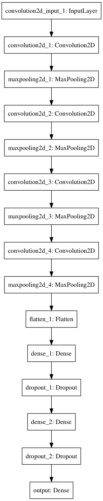

# CarND-Behavioral-Cloning
Behavioural learning project for Udacity's self-driving car nanodegree program.

## Python environment
`conda env create -f environment.yml`
For GPU additionally we need to install `pip install tensorflow-gpu`

`conda install -c https://conda.anaconda.org/menpo opencv3`

Note: if you want to be able to run the `save_model_diagram.py` script to generate an image of the network you will need to have GraphViz installed and also pydot via: `pip install pydot-ng` (this is the one that works with the Keras visualisation code).

## Data
Initially I am using the provided dataset as I do not have a joystick to generate reliable data with the driving simulator.
Ensure you have a sub-directory called `logs` for tensorflow event logs to be written to (for use by Tensorboard).

To get the data directory just unzip the dataset which already has the contents in folders data/IMG.
Dataset: https://d17h27t6h515a5.cloudfront.net/topher/2016/December/584f6edd_data/data.zip

First working model was based on images resized down to 32 rows x 16 columns. Even though the model was flawless on track 1 the driving behaviour was a bit wobbly in some strsight sections.

On the second test track in the simulator the car can get approx 3/4 of the way through the course before it hits the wall on a cliff face. One are of research is to look at the colour spaces used and pick single channels to see if the road is picked up better by the convulation layers considering how much darker the second track is. Another area of research would be to dynamically add dark shadows onto the training data.


## Model Architecture
The base of this model is from the Keras lab for traffic sign classification (See the Jupyter notebook traffic-sign-classification-with-keras.ipynb here https://github.com/js1972/CarND-Keras-Traffic-Sign-Classifier). I added to my final model in this lab one more convolutional layer and one more fully connected layer. Initially I was having trouble getting around the track so dropped all the Dropout layers as a test and gradually added them back in (just between the fully-connected layers.

I found that adding more Dropout (such as between the conv layers) actually decreased the performance of the trained model. as a learning exercise I could try weight penalty style regularisaton instead.

This model was quite similar to the Nvidia model so I assumed it to have plenty of capability.

I used a linear activation layer as the final layer as this model is to perform a regression task of predicting a *real* value.

The final architecture is:<br>


The entry point to the model is a numpy array of the image data with shape (32, 16, 3). The data is normalised between -1 and +1 in the data pre-proecssing step. *Note that we could have used a Keras Lambda layer to include it directly in the model*.

I am using the ADAM optimiser as a default as that is what was tested and worked well in the Keras traffic sign classifier. However I adjusted the learning rate down an order of magnitude to 0.0001 from the default of 0.001. Without dropping the learning rate I found that testing the model caused the car to veer off the first couple of corners.

## Processing steps in training the model
#### Use all camera data
Execute the Jupyter Notebook `pre_process_data.ipynb`. This notebook includes code to simply concatenate the columns of filenames from the left and right cameras on the center camera column (and adjusting the steering angles +/- 0.25 respectively).
We can no run the same code on all the cameras or just the center camera with the argument `alldata False`.

#### Run the training process
Execute `python model.py` to start training the model. The steps taken are as follows:

1. Print out the current FLAGS - **run with defaults for the best working model**.
2. Read in the data file containing the image filenames and camera angles.
3. Split the data into training and validation sets (after shuffling) and convert to numpy arrays.
4. Define the Convolutional model (See graphic above).
5. Setup Early Stopping with patience of 3 epochs and Model Checkpointing so that the model weights are saved after each epoch if the validation loss is the lowest so far. Additionally I output logs for Tensorboard so I can keep an eye on the process while training.
6. We now train the model using a generator function. The generator function (in the utils module) performs data augmentation and pre-processing (the pre-processing is also applied in drive.py as the model must see the same type of images). Details of the augmentation and pre-procesing are provided below.

#### Data Augmentation
As we have a limited training set (note: that I used the Udacity provided training set as it was too difficult to drive the simulator with the keyboard arrow keys) we need to augment the data in various ways on-the-fly in the generator function.
After testing various methods in the notebook `data_processing.ipynb` I settled on the following:
- Brightness augmentation. To vary the brightness of the images that the model is trained on we convert the images to the HSV colour-space and adjust the V values (with a min of 0.25 to avoid images that are too dark.) The purpose of this brightness augmentation is to help the model with shadowy parts of the track and also where the track edges are different colours and types.
- Random horizontal flips. With a 50% likelihood we randomly flip the images left/right (and adjust the corresponding steering angles). This is purely to give the model more training data. I have not set out to balance the data such that there are an equal number of straight sections and left/right turns, though that could be a good exercise for the future.

#### Data pre-processing
For pre-processing the image data I attempted various techniques that were tested in the above-mentioned notebook and settled on the following:
- Cropping and resizing the images. There is allot of data in the images which I don't think helps the model like scenery and the bonnet of the car. I have cropped the top 55 pixels off the image and also remove the pixels below row 135. finally I have resized the images to 32x16 (thats 32 rows by 16 columns.) At first this resize shape was a mistake as I wanted it 32 wide but it actually performs well at this size and I could get no better improvement by increasing the sizes to 32x32 or even 64x64 pixels. Cropping the image made a significant performance difference and when I did this it was the first time the car went all the way around the track!
- Normalising the images. I decided to normalise the numpy array data for each image between -1 and +1.

Notes: I did some basic testing with colour spaces. I switched to HSV and ran the model on that but there was no discernable improvement on track 1 or 2. I then trained on just the V layer of the HSV images and performance was worse so I went back to the original RGB images.

## Training
Run the model with default parameters: `python model.py`
The default params are:
- image_dir data/IMG/ (this is the path to the image files)
- data_path data/driving_log.csv (this is the filename for the data file containing image filenames and steering angles - plus other info)
- batch_size 128 (default taking from previous CarND work)
- num_epochs 20 (I use early stopping with a patience of 3 epochs, so this is just a maximum value)
- lrate 0.0001 (I found the model was far better at this lower learning rate than the ADFAM default)
- alldata True (use all the camera angles)
- dropzeros False (Drop 50% of the straight roads - 0 steering angle. This was used during testing but not required now)

As above just run with the defaults to train a working model which is currently saved into the `save` sub directory.

<br>
While training you can check the logs with tensorbard `tensorboard --logdir=./logs` (but clear out the logdir first).

Current trained model https://www.dropbox.com/s/xecw5h6zq94zo9v/model.h5?dl=0

If the model has been trained on AWS you can copy the model to your local PC with: `scp carnd@<aws ip>:/home/carnd/CarND-Behavioral-Cloning/save/model.h5 save/model.h5` and likewise with the model definition which is saved to model.json.

## Prediction - Testing the model
To run the trained model on the simulator, first start up the Udacity driving simulator app in autonomous mode. Select Track 1.
Then run the following at the terminal:
```
python drive.py save/model.json
```
Now watch the car drive endlessly around Track 1.
You can attempt Track 2 but I have found it crashes into the cliff face approx 3/4 of the way along. More work needed on pre-processing and/or augmentation here...

[](http://www.youtube.com/watch?v=uI2e_8HvAp0 "Track 1")
